# CHASHNI — چاشنی

### Premium QR Restaurant Experience

A mobile-first bilingual QR restaurant menu and ordering experience designed as a high-end portfolio project.

<p align="center">
  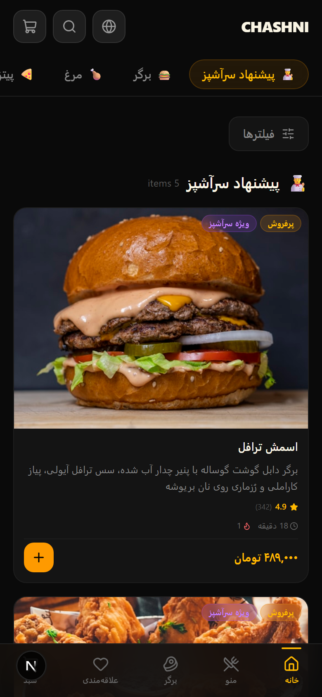
</p>

---

## Overview

**CHASHNI** is a fictional premium fast-food restaurant. Customers scan a QR code at their table and enter a polished digital menu experience — complete with product customization, live pricing, a Build Your Burger wizard, smart upsells, search, filters, favorites, cart, checkout, and simulated order tracking.

This project demonstrates **product design, mobile-first UX, bilingual architecture, RTL/LTR support, e-commerce interaction design, testing, and automated visual documentation**.

---

## Why CHASHNI

Most restaurant demos look like generic templates. CHASHNI was built to feel closer to a **premium native food-ordering app** than a typical website. Every detail — from the dark visual language to the animated product sheets — is designed to showcase what a real-world QR restaurant experience could look like.

---

## Key Features

| Feature | Description |
|---|---|
| **QR Table Ordering** | Each table has a unique QR code linking to the menu with table context |
| **Bilingual (FA / EN)** | Full Persian and English support with proper RTL / LTR layouts |
| **Smart Menu** | 38 realistic menu items across 9 categories with rich metadata |
| **Product Customization** | Option groups, extras, quantity, special notes with live pricing |
| **Live Price Calculation** | Base + options + extras × quantity — updated in real time |
| **Build Your Burger** | Step-by-step interactive burger builder with visual stack preview |
| **Smart Upsells** | Contextual "Complete your meal" recommendations after adding items |
| **Search** | Full-text search across names, descriptions, ingredients, categories |
| **Filters** | Vegetarian, Spicy, Bestseller, Chef's Pick, New — with filter chips |
| **Favorites** | Heart-toggle products, persisted to localStorage |
| **Cart** | Persistent cart with customization details, quantity control, totals |
| **Checkout** | Dine-in / Takeaway with form fields and simulated payment |
| **Order Tracking** | Simulated real-time order status timeline |
| **Responsive Design** | Mobile-first (390px) with tablet and desktop layouts |
| **PWA-like UX** | Manifest, theme color, standalone-friendly viewport |
| **Demo Admin** | Mock restaurant management dashboard |
| **Design System** | Component showcase for portfolio documentation |

---

## Screenshots

### Mobile Experience

<p align="center">
  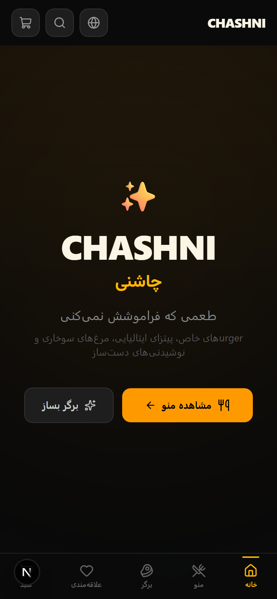
  
  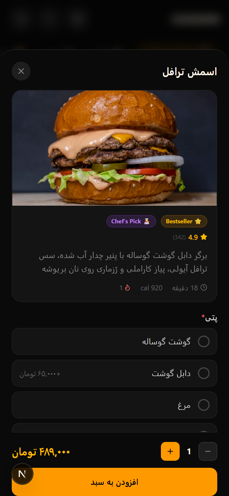
  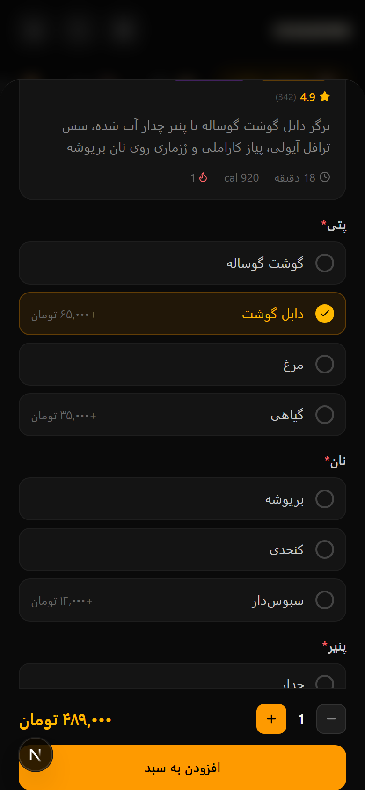
</p>

<p align="center">
  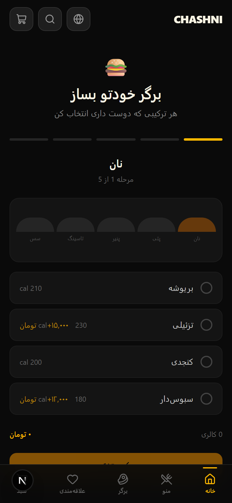
  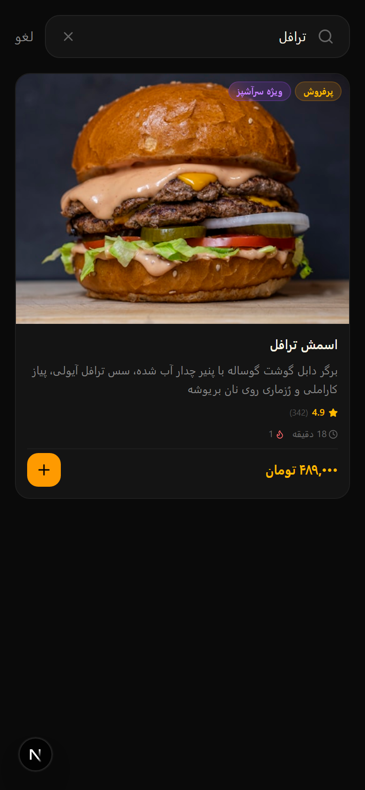
  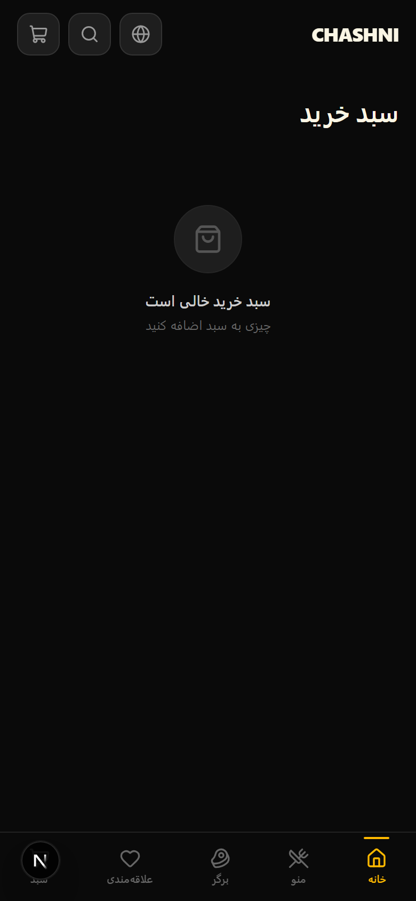
  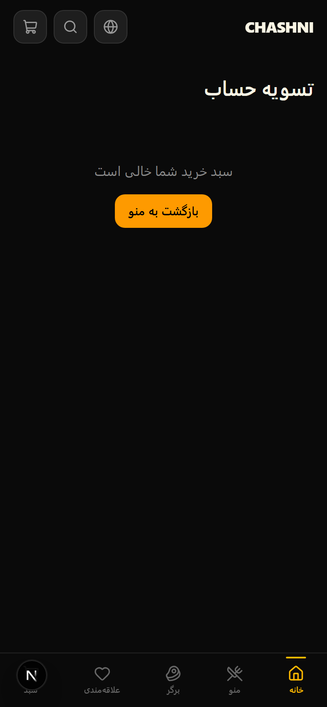
</p>

<p align="center">
  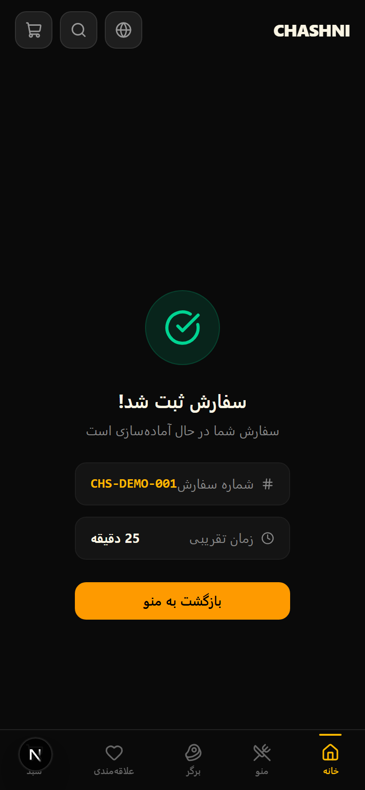
  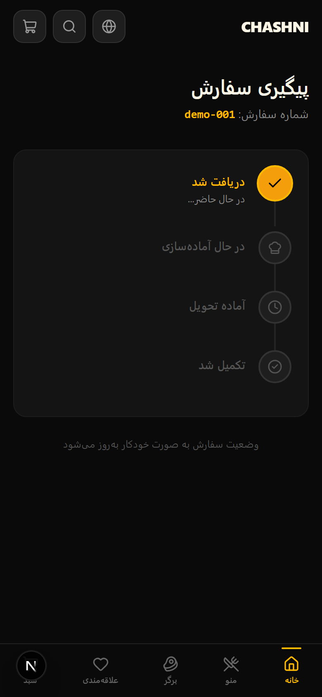
  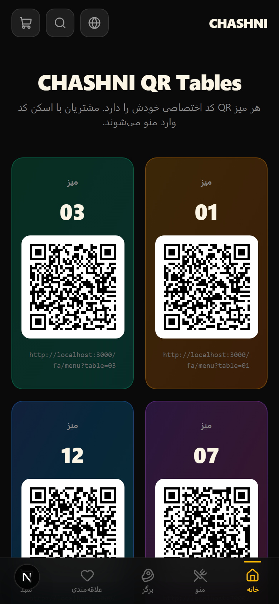
  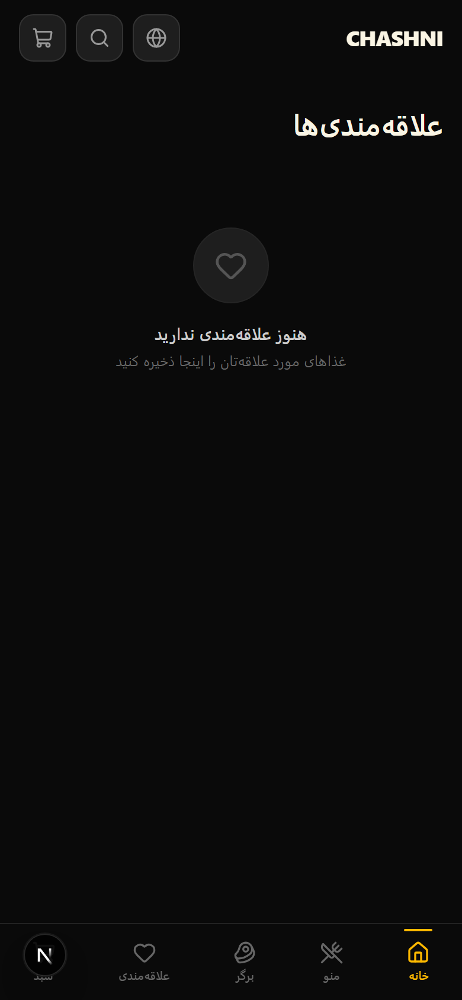
</p>

### Desktop Experience

<p align="center">
  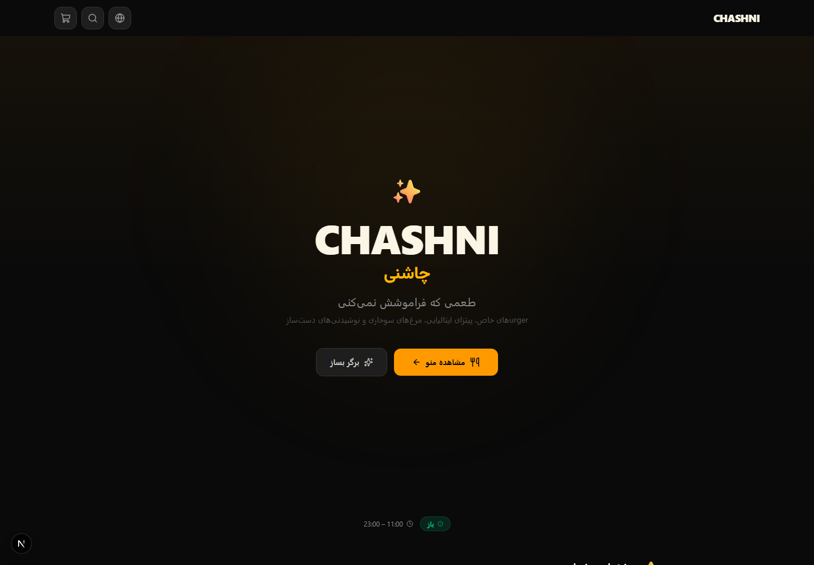
</p>

<p align="center">
  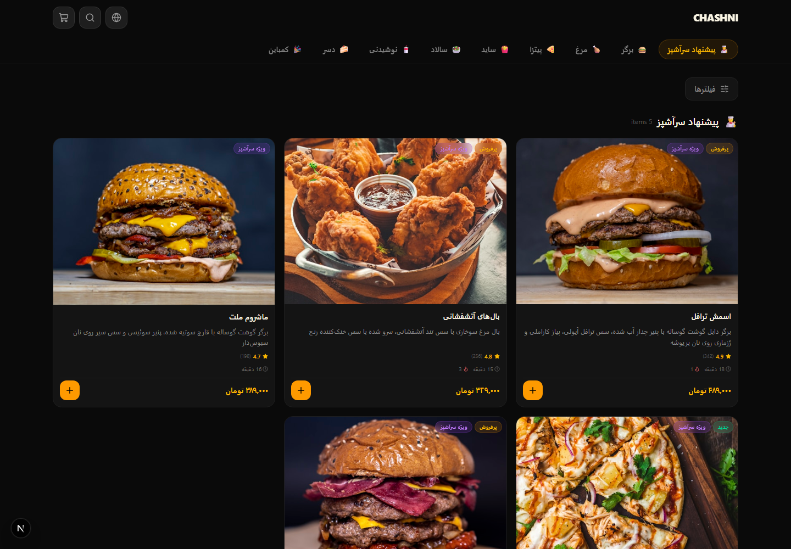
</p>

### Internal Demo

<p align="center">
  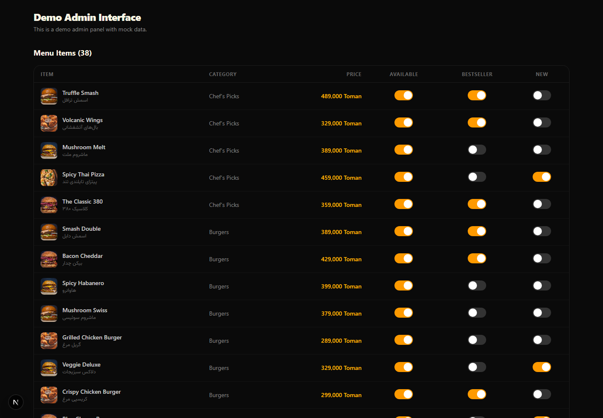
</p>

<p align="center">
  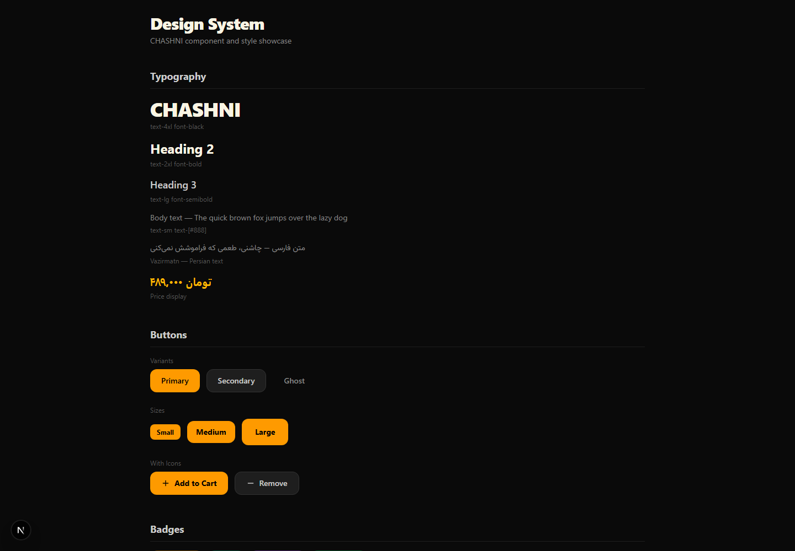
</p>

---

## QR Table Flow

The core UX loop:

1. Customer sits at a table and scans the **QR code**
2. The URL includes the table number (e.g., `/fa/menu?table=07`)
3. The menu loads with a subtle **"میز ۰۷"** badge in the header
4. Customer browses, customizes, adds items to cart
5. Cart and checkout **remember the table number**
6. On order placement, the table context is included
7. Order tracking shows estimated preparation time

A dedicated **QR Demo page** (`/fa/qr-demo`) showcases QR codes for tables 01, 03, 07, and 12.

---

## Bilingual Architecture

- **Persian (FA)** — Default language, proper RTL layout
- **English (EN)** — Full LTR layout
- Locale determined by URL prefix: `/fa/...` or `/en/...`
- All content: product names, descriptions, categories, UI labels, buttons, states — in both languages
- Persian typography uses **Vazirmatn** font; English uses **Inter**
- Toggle language from the header Globe button — redirects to the other locale

---

## Product Customization

Each product can have:

- **Option groups** (radio / checkbox) — e.g., Patty type, Bun type, Cheese
- **Extras** — add-ons with individual pricing
- **Quantity** control
- **Special notes** textarea
- **Live price** that updates as selections change

---

## Build Your Burger

A step-by-step interactive wizard:

1. **Choose bun** — Brioche, Pretzel, Sesame, Whole Wheat
2. **Choose patty** — Single Beef, Double, Chicken, Plant-based
3. **Choose cheese** — Cheddar, Swiss, Pepper Jack
4. **Choose toppings** — up to 8 options
5. **Choose sauce** — 6 sauce options
6. **Review & name** your custom burger

Visual stack preview + running price + calories estimate.

---

## Cart & Checkout

- Cart persists to **localStorage** across sessions
- Supports **Dine-in** and **Takeaway** order types
- Dine-in auto-selected when opened via table QR
- Checkout includes: customer info, payment method selection, order summary
- Simulated payment flow (clearly labeled as demo)
- Order success with order number, estimated time, and items summary

---

## Order Tracking

Simulated real-time order status:

| Status | Persian |
|---|---|
| Order received | سفارش ثبت شد |
| Preparing | در حال آماده‌سازی |
| Ready | آماده سرو |
| Completed | تحویل شد |

Visual timeline with animated progress and auto-progression for demo purposes.

---

## Responsive Design

| Viewport | Description |
|---|---|
| 360px | Minimum supported |
| 375px | iPhone SE |
| 390px | **Primary target** (iPhone 13) |
| 430px | iPhone Pro Max |
| 768px | Tablet |
| 1024px | Tablet landscape |
| 1440px | Desktop |

Mobile layout is purpose-built as a mobile ordering app — not a shrunk desktop. Desktop adds multi-column layouts and editorial spacing.

---

## Tech Stack

| Technology | Usage |
|---|---|
| **Next.js 16** | App Router, server components |
| **TypeScript** | Full type safety |
| **React 19** | UI library |
| **Tailwind CSS 4** | Utility-first styling |
| **Framer Motion** | Animations and transitions |
| **Lucide React** | Icon system |
| **Zod** | Schema validation |
| **React Hook Form** | Form handling |
| **QRCode.react** | QR code generation |
| **Playwright** | E2E testing and screenshot automation |

---

## Project Structure

```
chashni/
├── src/
│   ├── app/                    # Next.js App Router pages
│   │   ├── [locale]/           # Localized routes (fa / en)
│   │   │   ├── page.tsx        # Landing / Home
│   │   │   ├── menu/           # Main menu
│   │   │   ├── cart/           # Cart page
│   │   │   ├── checkout/       # Checkout flow
│   │   │   ├── build-burger/   # Build Your Burger
│   │   │   ├── favorites/      # Favorites page
│   │   │   ├── order/          # Order success + tracking
│   │   │   └── qr-demo/        # QR table demo page
│   │   └── demo/
│   │       ├── admin/          # Demo admin dashboard
│   │       └── design-system/  # Component showcase
│   ├── components/
│   │   ├── ui/                 # Reusable UI (Button, Price, Rating, Badge...)
│   │   ├── layout/             # Header, Footer, MobileNav
│   │   ├── menu/               # ProductCard, ProductSheet, CategoryTabs...
│   │   ├── cart/               # FloatingCartBar, CartDrawer, UpsellCard
│   │   ├── burger-builder/     # Interactive burger wizard
│   │   ├── search/             # SearchOverlay, FilterSheet
│   │   ├── order/              # OrderTimeline, OrderSuccess
│   │   └── restaurant/         # RestaurantStatus, RestaurantInfo
│   └── lib/
│       ├── types/              # TypeScript interfaces
│       ├── data/               # Menu, categories, restaurant data
│       ├── utils/              # Price formatting, calculations
│       ├── hooks/              # Cart, favorites, locale, search, table, filters
│       └── providers/          # React context providers
├── e2e/                        # Playwright tests and screenshots
├── public/                     # Static assets
│   └── readme/                 # README screenshots (auto-generated)
├── playwright.config.ts
└── package.json
```

---

## Getting Started

### Prerequisites

- Node.js 18+
- npm

### Installation

```bash
git clone https://github.com/alibayern1369/chashni.git
cd chashni
npm install
```

### Development

```bash
npm run dev
```

Open [http://localhost:3000/fa](http://localhost:3000/fa) (Persian) or [http://localhost:3000/en](http://localhost:3000/en) (English).

### Production Build

```bash
npm run build
npm start
```

---

## Available Scripts

| Script | Description |
|---|---|
| `npm run dev` | Start development server |
| `npm run build` | Production build |
| `npm start` | Start production server |
| `npm run lint` | Run ESLint |
| `npm run typecheck` | TypeScript type checking |
| `npm run test:e2e` | Run Playwright E2E tests |
| `npm run screenshots` | Run Playwright screenshot automation |

---

## Playwright Tests

### Smoke Tests

```bash
npm run test:e2e
```

Tests cover:
- Menu loads with categories and products
- Language switch works (FA → EN)
- Product detail sheet opens on click
- Cart badge updates on add-to-cart
- Build Burger page loads with step 1
- Table query parameter shows table badge
- QR demo page renders QR codes

### Screenshot Automation

```bash
npm run screenshots
```

Screenshots are captured against the **real running application** using Playwright:

- **Viewport**: 390×844 (mobile) and 1440×1000 (desktop)
- **Output**: `public/readme/`
- **17 screenshots** covering all major features
- Screenshots wait for fonts, images, and animations to stabilize
- Interactive states are reached through actual user interactions (clicks, typing, scrolling)
- To regenerate: restart dev server, run `npm run screenshots`

---

## Architecture Decisions

- **No heavy i18n library** — Locale routing uses URL prefix (`/fa/`, `/en/`) with inline content switching. Keeps the bundle small.
- **localStorage for persistence** — Cart and favorites persist client-side. No backend required.
- **Simulated ordering** — Checkout flow completes with mock order generation. No real payment integration needed.
- **Dark theme** — Deep charcoal backgrounds with warm amber accents. Premium restaurant aesthetic.
- **Mobile-first components** — Every component is designed for 390px first, then enhanced for larger screens.

---

## Accessibility

- Semantic HTML structure
- Keyboard navigation support
- Visible focus states
- Sufficient color contrast on dark theme
- Alt attributes on images
- ARIA labels on interactive elements
- Reduced-motion consideration via CSS media queries

---

## Performance

- Responsive images with proper aspect ratios
- Lazy loading for off-screen content
- Minimal JavaScript — no heavy state management library
- Optimized font loading (Vazirmatn + Inter via Google Fonts)
- Skeleton loading states for perceived performance
- Client-side persistence avoids unnecessary re-renders

---

## Future Improvements

- Backend API integration for real ordering
- Real-time order tracking via WebSocket
- User authentication for order history
- Payment gateway integration
- Multi-branch support with branch selection
- Push notifications for order updates
- Analytics dashboard for restaurant owners
- Full offline support with service worker
- A/B testing for menu layout optimization

---

## License

This project is a portfolio demonstration. All restaurant data is fictional.

---

<p align="center">
  <strong>CHASHNI — چاشنی</strong><br/>
  <em>Premium QR Restaurant Experience</em>
</p>
